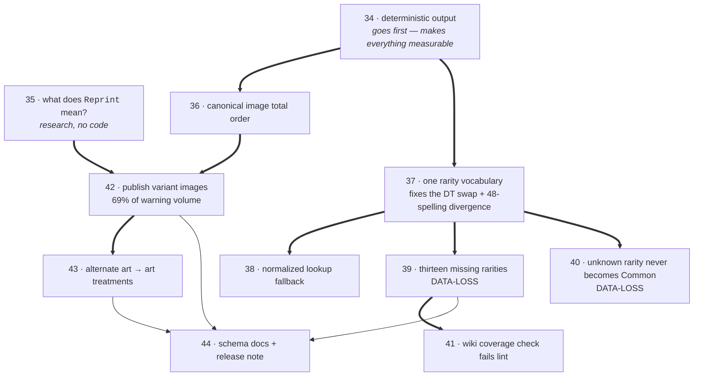

# Wave 2 — one rarity vocabulary, deterministic output, and image variants

**Base branch:** `feature/various-pipeline-fixes`

Implements issues #6, #13, #17, #12, #3 and #10 from the
[2026-08-06 warning audit](https://github.com/matt-roz/YGOJSON/issues/20), and resolves the decision
track #9. This PRD does not replace those issues; it records what a design interview settled that they
left open, and corrects several of their claims that turned out to be wrong when checked against
Yugipedia's own data module and image policy.

## Problem Statement

Three separate things are wrong with the published database, and none of them announce themselves.

**Rarities are wrong, and sometimes wrong for a whole gallery at once.** Someone looking up
`Limit Over Collection: The Heroes` loses its eighteen *Grand Master Rare* printings in every one of
its three locales (jp/kr/sc), and one of its gallery tables degrades wholesale to Common — the
gallery declares a default rarity the importer does not recognise, and the code path that handles
that replaces the entire default rarity list with Common rather than the one entry it failed to
read. The same happens to `Limit Over Collection: The Rivals`. Someone looking up `Limited Pack GX: Ra Yellow` finds ten
printings that should carry both an Ultra Rare and an *Ultra Rare (Special Blue Version)* printing;
the Special Blue ones are gone. `Advanced Event Pack 2025 Vol.2` (OCG-KR) loses two Secret Blue rarities
because the wiki wrote the name without parentheses. Every Rush Duel rarity is dropped outright.

Worse, whether a rarity resolves depends on **where on the page it appears**. A set list that declares
`rarities=Super Rare` at the template level resolves correctly; the identical string in a row is
dropped. Forty-eight known rarity spellings behave this way, including `super`, `ultra`, `secret`,
`ghost`, `gold`, `parallel`, `starlight` and the entire Millennium and Kaiba Corporation families.
Duel Terminal rarities written out in full resolve to the *opposite* rarity from the one the
abbreviation gives — same string, same run, two different answers depending on which parser sees it.

**The database changes between runs when nothing upstream has changed.** Two consecutive runs over the
same wiki content produce different files. The most visible cause is image selection: roughly 1,288
printings have several images and the importer keeps whichever arrived first from an asynchronous
fetch, so the same printing ships base art on one run and alternate art on the next. The larger cause
is invisible: the serializer builds per-card and per-edition keys by iterating Python sets whose
members hash by identity or by randomised string hash, and nothing sorts the output. That churns the
key order of **every set file in the database**, all 3,376 of them, on every run. A consumer diffing
two published snapshots cannot tell a real change from noise, and neither can we.

**Variant images are collected and then thrown away.** Around 1,288 printings have more than one image
on Yugipedia — alternate artworks, different text-era printings, stamped tournament variants. The
importer gathers all of them, logs a warning saying it found several, keeps one, and discards the
rest three lines later. Those 1,480 warning lines are 69% of the entire run's warning volume, and
under the current design none of them are actionable, so they buried the two genuine corruptions that
Wave 1 fixed.

## Solution

One place that knows what a rarity is, output that does not change unless the wiki changes, and the
variant images published instead of discarded.

From a consumer's perspective:

- A rarity that Yugipedia can express is a rarity the database can express. Grand Master Rare, the
  Rush Duel rarities, Holofoil, Secret Ultra and the colour variants all appear as themselves.
- A rarity resolves the same way regardless of where on the wiki page it was written. There is one
  answer per spelling, not one per parser.
- Punctuation and spacing variance on the wiki stops costing printings. The importer adopts
  Yugipedia's own normalisation rather than requiring exact string matches against hand-written keys.
- An unrecognised rarity is never silently replaced with Common. It is reported, and the printing
  carries no rarity rather than a wrong one.
- Two runs over the same wiki content produce byte-identical files, so a diff between published
  snapshots means something.
- The image chosen for a printing is chosen by a stated rule, not by whichever network request
  finished first.
- Printings that have several images publish all of them, tagged with the wiki's own code, and the
  ones whose meaning is documented also carry a typed classification.
- Alternate artworks resolve into the card's existing art-treatment list, so they can be queried the
  same way YGOPRODECK-sourced artworks already are.

The rarity behaviour is defined by Yugipedia's machine-readable rarity module, which was read during
design and which supersedes the stale hand-copy of the rendered rarity template currently carried as a
comment in the importer. The image-variant behaviour is defined by Yugipedia's image policy, which
documents the card image filename format and the meaning of a small number of its trailing codes.

## User Stories

1. As a deck-builder app developer, I want every card in `Limit Over Collection: The Heroes` to carry its real rarity, so that a gallery I render does not show an entire set as Common.
2. As a collection-tracker developer, I want Grand Master Rare printings to exist in the data, so that a user who owns one can record it.
3. As a collection-tracker developer, I want Rush Duel rarities to exist in the data, so that Rush products are representable at all once Rush cards are imported.
4. As a data consumer, I want `Ultra Rare (Special Blue Version)` printings in `Limited Pack GX: Ra Yellow` to be present, so that the ten cards with a blue variant are not silently reduced to their plain Ultra Rare printing.
5. As a data consumer, I want a rarity written with different punctuation on the wiki to resolve to the same rarity, so that an editor's spacing choice does not delete a printing.
6. As a data consumer, I want Duel Terminal rarities written out in full to mean the same thing as their abbreviations, so that two spellings of one rarity do not produce two different values.
7. As a data consumer, I want a rarity string to resolve identically whether it appeared as a set default or in an individual row, so that the data does not depend on wiki formatting choices that have no meaning.
8. As a data consumer, I want a printing whose rarity could not be determined to carry no rarity, so that I can distinguish "unknown" from "Common" instead of being told a plausible falsehood.
9. As a data consumer, I want one unreadable entry in a set's default rarity list not to discard the readable ones, so that a single unknown rarity does not mis-label an entire set.
10. As a price-tracking developer, I want rarity values to be stable across runs, so that price series keyed on rarity do not break when a rarity silently changes.
11. As a data consumer, I want two published snapshots taken a day apart to differ only where the wiki differed, so that I can diff them to find real changes.
12. As a data consumer, I want the image chosen for a printing to be the same on every run, so that my cached images do not invalidate for no reason.
13. As a data consumer, I want the image chosen for a printing to be the plain printing rather than an arbitrary variant, so that the default image is the one a user expects to see.
14. As a data consumer, I want printings with several images to publish all of them, so that I do not have to scrape Yugipedia myself for alternate artworks.
15. As a data consumer, I want each variant image tagged with the code the wiki used, so that I can interpret variants we have not classified.
16. As a data consumer, I want the variants whose meaning is documented to carry a typed classification, so that I do not have to learn Yugipedia's filename conventions to use the data.
17. As a data consumer, I want alternate artworks to resolve into the card's art-treatment list, so that I can query them the same way I query the artworks that already come from YGOPRODECK.
18. As a data consumer, I want a variant image entry to say which art treatment it depicts, so that a scan showing different art is identifiable as such rather than being an unlabelled second URL.
19. As a data consumer, I want unrecognised variant codes carried through rather than dropped, so that data we do not understand is still data I can use.
20. As a Yu-Gi-Oh! player, I want to find the alternate artwork printings in `Quarter Century Art Collection` and `Prismatic Art Collection`, so that the database reflects what makes those products interesting.
21. As a schema consumer, I want the new variant information added alongside the existing image field rather than replacing it, so that my existing integration keeps working unchanged.
22. As a schema consumer, I want new rarity values documented in the published schema, so that my validator does not reject a database we consider valid.
23. As a schema consumer, I want to be told which enum gained values in a release note, so that a strict validator failing is something I was warned about rather than something I discover in production.
24. As a maintainer, I want one place that knows what a rarity is, so that adding a rarity is one edit rather than four that must agree.
25. As a maintainer, I want the lookup tables derived rather than hand-maintained in parallel, so that the class of bug where two tables disagree cannot recur.
26. As a maintainer, I want the build to fail when Yugipedia introduces a rarity we do not model, so that the next Grand Master Rare is caught in seconds rather than found months later in a log.
27. As a maintainer, I want that check to run before any importing, so that a new rarity costs me a lint failure rather than most of a day of pipeline time.
28. As a maintainer, I want a normalisation collision to be impossible to ship, so that making lookups more forgiving cannot silently merge two distinct rarities.
29. As a maintainer, I want a run to end with a summary of every unknown rarity string it saw and how often, so that malformed wiki values are visible without reading thousands of log lines.
30. As a maintainer, I want every rarity warning to name the page and the string, so that a warning is actionable on its own.
31. As a maintainer, I want the gallery row parser to report an unrecognised rarity rather than silently keeping the default, so that the count of affected rows is real rather than an undercount.
32. As a maintainer, I want the importer's copy of Yugipedia's rarity list to be checked against the wiki rather than transcribed by hand, so that it cannot go stale unnoticed.
33. As a maintainer, I want the published key ordering to be deterministic, so that the every-two-days cron run becomes an instrument I can read rather than noise.
34. As a maintainer, I want determinism verified by running twice with different hash seeds rather than by pinning a seed, so that the fix works across CI machines rather than only appearing to.
35. As a maintainer, I want the effect of the rarity rewrite measured across every set list and gallery page before it merges, so that I know what else changed besides what I intended.
36. As a maintainer, I want the multiple-images warning to stop firing 1,480 times per run once the images are actually published, so that the remaining warnings are ones somebody should read.
37. As a contributor, I want the rarity vocabulary to be a module I can reason about without reading the importer, so that changing a rarity does not require understanding wikitext parsing.
38. As a contributor, I want the meaning of Yugipedia's variant codes stated and cited, so that I do not invent semantics for a code somebody already documented.
39. As a contributor, I want to know which claims in the source issues were checked and found wrong, so that I do not verify against an assertion that no longer holds.
40. As a reviewer, I want the schema additions to be additive and optional, so that the change is assessable without auditing every consumer.

## Implementation Decisions

### Scope

- Wave 2 implements #6, #13, #17, #12, #3 and #10, and resolves #9 by publishing variants rather than
  closing it as won't-do.
- Delivered as a **single pull request** off `feature/various-pipeline-fixes`, with sequenced slices,
  matching Wave 1's shape.
- Slice order is constrained: **the determinism work lands first**. Every other verification in this
  wave — the corpus comparison, the before/after set JSON, the post-merge cron diff — is unreadable
  while published key ordering churns on every run.

### Rarity vocabulary — a new module

- A new top-level module in the package holds the rarity vocabulary. `CardRarity` itself stays where
  it is, next to the rest of the schema dataclasses; the new module imports it.
- The module holds **one canonical table**. Each row is a canonical key, the enum member it maps to,
  Yugipedia's official abbreviation, and the accepted spellings. The abbreviation is the one the wiki
  publishes, never invented.
- The three lookups the importer needs — exact spelling to member, normalised spelling to member, and
  spelling to abbreviation — are **derived from that table at import time**. They are not written by
  hand and cannot drift from it.
- The module's public interface is two functions: resolve a raw string to a rarity, and resolve a raw
  string to an official abbreviation for filename construction. Both are pure.
- The four existing tables in the importer are removed, along with the five inline lookup expressions.
  All five call sites route through the resolver, so the answer no longer depends on which parser is
  asking.
- Lookup is exact-match first, then normalised. The exact path cannot change any lookup that succeeds
  today; the normalised path only ever rescues one that fails.
- Normalisation is casefold plus removal of non-alphanumeric characters. This is **Yugipedia's own
  normalisation**, taken from its rarity module, not an invention of ours.
- The alt-column mechanism that promotes a base rarity plus a colour into a distinct rarity is left
  structurally alone. It is keyed on a rarity/colour pair rather than on a name, and folding it into a
  name table would make the table carry two kinds of key for no gain.

### New rarity members

Twelve members are added. A thirteenth wiki rarity, `Ultra Rare (Special Blue Version)`, already has
an enum member and needs only to be reachable by name.

Naming follows the dominant existing convention — words, with a `base-variant` value for variants,
matching the existing colour variants:

| Wiki rarity | Value |
|---|---|
| Grand Master Rare | `grandmaster` |
| Rush Rare | `rush` |
| Gold Rush Rare | `goldrush` |
| Over Rush Rare | `overrush` |
| Full Over Rush Rare | `fulloverrush` |
| Holofoil Rare | `holofoil` |
| Secret Ultra Rare | `secretultra` |
| Ultra Rare (Special Red Version) | `ultra-red` |
| Rush Rare (Special Red Version) | `rush-red` |
| Over Rush Rare (Premium Black Version) | `overrush-black` |
| Quarter Century Secret Rare (Special Version) | `25thsecret-special` |
| Quarter Century Secret Rare Tokyo Dome Green Version | `25thsecret-tokyodome` |

Five rarities we model do **not** appear in Yugipedia's module — Parallel Rare, Parallel Common, Hobby
Rare, Kaiba Corporation Secret Rare and Duel Terminal Parallel Common. They are retained. Removing a
published enum value is breaking, and old wikitext may still use them.

The `ultra-green` member has no counterpart in Yugipedia's module at all. It is retained unchanged and
remains reachable only through the alt-column mechanism, with no name mapping added.

### Guards

- **Collision assertions run at import time**, in the rarity module, when the derived maps are built.
  If two canonical rows normalise onto the same key but different members, the package fails to
  import. This is the cheapest signal the repository has and it is impossible to skip.
- **A coverage check ships as a script alongside the existing schema validator.** It fetches
  Yugipedia's rarity module and asserts that every rarity the wiki defines resolves to some member of
  ours. The comparison is deliberately **one-way**: the wiki must be a subset of us, not equal to us,
  because we retain rarities the wiki has dropped.
- The coverage check runs in the lint job and **fails the build in production**. It fails on the
  condition that matters — the wiki knows a rarity we do not — rather than on the accident of whether
  a set using it happened to be imported that night.
- The importer itself is **not** made fatal on an unknown rarity. The database job is a strictly
  sequential chain where a failure abandons the rest of the run; one new wiki rarity must not cost the
  entire nightly build.

### Unknown-rarity behaviour

- All five call sites behave the same way: warn, naming both the page and the unresolved string, and
  omit that rarity. Common is never substituted.
- The set-default path currently replaces the *whole* default rarity list with Common when any single
  entry fails to resolve. It is changed to drop only the entry it could not read.
- The gallery row path currently fails silently, keeping the gallery default with no warning at all.
  It is changed to report, which also means the true size of this problem becomes measurable for the
  first time.
- A run ends with a summary of the distinct unknown rarity strings seen and their counts. This is
  deliberately rarity-specific and narrow; the general warning histogram is Wave 3's work and this
  must not absorb it.

### Determinism

- The canonical image for a printing/edition is chosen by an explicit **total order**, extracted as a
  small pure function: prefer the entry with no variant code, then fall back to a stable ordering of
  the codes. A total order is required rather than a special case, because some printings have no
  plain entry at all.
- The importer's per-locale edition collection is currently a set of enum members. Enum members hash
  by name and Python randomises string hashing per process, so iteration order differs on every run.
  This affects the published edition array order and the choice of the set's own pack image. Edition
  iteration is made ordered.
- The serializer builds its per-edition and per-printing key sets with set comprehensions over
  identity-hashed printing objects and hash-randomised edition enums, and nothing sorts the output.
  Both are made deterministic. This is the single largest source of churn in the published database
  and it is unrelated to images.
- **The hash seed is not pinned.** Pinning it would mask the defect rather than fix it, and the
  published database must be stable across CI machines that do not share a seed.
- Other order-dependent reads are audited as the double-run diff surfaces them, rather than assumed
  to be absent.

### Image variants

- Variants are carried at the **image-entry level**, inside the non-deprecated per-printing info
  object that already holds the canonical image and price. One printing, one canonical image, a
  collection of variants alongside it.
- The deprecated parallel card-images mapping is **not** extended. It keeps publishing the canonical
  image only.
- Each variant entry carries the wiki's raw code, the image URL, and optionally a typed classification
  and an art-treatment reference.
- A new `ImageVariant` vocabulary is added as an enum with its string-to-enum map, following the
  existing convention for vocabularies, and gets its own published schema file. It is deliberately
  **small**, containing only the codes whose documented meaning survived being checked against the
  wiki's own galleries:
  - alternate artwork;
  - official proxy;
  - official website artwork.
- **`Reprint` and `Reprint2` are not typed.** They join the verbatim-only tail. Yugipedia's image
  policy defines `Reprint` as marking a card originally released before the Magic-to-Spell rename
  shown in its Spell version, and editors do use it that way — `Set Card Galleries:Pharaonic Guardian
  (TCG-NA-UE)` heads its section `== Reprints (''Magic'' to ''Spell'') ==`, and
  `Forest-LOB-NA-C-UE.png` reads `[MAGIC CARD]` against `[SPELL CARD]` on its `-Reprint`. But they
  also use it for print runs with no text change at all, and #35 established that the two usages are
  not distinguishable from the data we hold. `Legend of Blue Eyes White Dragon` and `Metal Raiders`
  each carry a second `alt=Reprint` section headed `== Legendary Collection reprints ==`; `Vol.1`
  tags its entire contents `==20th Anniversary Set reprints==`. Inside one gallery page, `Reprint`
  means the Spell version for `Forest` and the Legendary Collection printing for `Blue-Eyes White
  Dragon`. Other `-Reprint` files turned out to be a name errata (`Trial of Hell` → `Trial of
  Nightmare`), a Type errata (`Two-Mouth Darkruler`, Dragon → Dinosaur) and a numeric errata
  (`Steel Scorpion`, 3rd → 2nd turn). The OCG kept the 魔法 wording — `Dark Hole` reads
  【魔法カード】 in both `DarkHole-V1-JP-SR.jpg` and `DarkHole-V1-JP-SR-Reprint.png` — so a JP
  printing has no type-line Magic-to-Spell artefact to record, yet `Vol.1`, `Vol.4`–`Vol.7` and
  `EX Starter Box` account for 351 `Reprint` rows between them.
- A full scan of all 7,157 `Set Card Galleries:` pages found 2,095 rows carrying a `Reprint`/
  `Reprint2` alt across 48 pages. Grouped by the section heading the editor wrote above them:
  **64% say a print run explicitly** (`Legendary Collection reprints`, `2025 Reprint`,
  `20th Anniversary Set reprints`, `Reprints (Yugi & Kaiba Collector Box)`, `Main Deck`),
  **9% say the Magic-to-Spell change explicitly** (`Reprints (''Magic'' to ''Spell'')`,
  `Reprints (Pre-SRL ''Spell'')`, `Spell Cards reprints`), and **27% say nothing either way**.
- `Reprint2` carries no meaning of its own either: it is a collision-avoidance suffix, allocated only
  when `Reprint` was already taken for that card in the same gallery.
- **Unrecognised codes are carried verbatim with no classification.** They are not guessed at. With
  `Reprint`/`Reprint2` moved here the verbatim tail is now the larger part of the variant volume —
  roughly 110 keys across a dozen undocumented codes, several of them single-digit one-offs, plus the
  ~840 `Reprint`/`Reprint2` keys — and the verbatim map already carries all of them losslessly.
  Nothing is lost by leaving `Reprint` untyped: the images still publish and still carry the raw
  code. Promoting it to a typed member later is additive, and would then be done from data we are
  publishing rather than from a policy page that practice has outgrown.
- Because the extra images are now published, the multiple-images warning stops describing a data
  loss and is removed or reduced to an aggregate count.

### Art treatment linking

- Alternate-artwork scans resolve into the card's existing art-treatment list — the structure whose
  stated purpose is tracking when cards have multiple art treatments across multiple printings, and
  which is currently populated only from YGOPRODECK.
- The printing's own art-treatment reference continues to denote the treatment of its **canonical**
  image. A variant entry showing different art carries its own reference to the treatment it depicts.
  This keeps a printing single-valued while making the variant's subject explicit.
- Printings are **not** split. A printing remains identified by card, rarity and code suffix. Adding a
  dimension would reassign UUIDs for every affected printing, and printing UUIDs are the stable public
  handle consumers key on — a mass reassignment inside a wave whose goal is byte-identical output
  would make the verification unreadable.

### Schema changes

- The rarity enum gains twelve values.
- A new image-variant enum file is published.
- The per-printing info object gains an optional variants collection.
- The per-printing info object's definition currently uses the keyword for *additional* properties
  where it means *named* properties, so that object accepts anything and the schema validator would
  not catch a malformed variant addition. This is corrected as part of adding to it.
- All additions are optional. No existing field changes meaning, and no published value is renamed.
- The README's format documentation and a release note are part of this wave's done-criteria, not
  optional extras. Adding values to a published enum is technically breaking for a consumer
  validating strictly.

## Testing Decisions

### What makes a good test here

There is no test framework in this repository, no unit tests and no type checker, and adding one
remains an explicitly separate decision rather than a side quest inside another change. That decision
was revisited during the interview after the module boundaries were made explicit, and **it stands**:
no test runner is introduced by this wave.

Assertions are made about **published output** — does this printing carry this rarity, does this
gallery still say Common, are these two runs identical, does this printing publish its variants —
never about internal parser state. The one exception is the collision assertion, which is a
correctness invariant of a data table rather than a test of behaviour, and which therefore lives in
the code as an import-time assertion rather than in a test.

### Prior art

`test/validate_data.py` is the only thing resembling a test. It validates generated output against the
v1 JSON schema and can only run after a pipeline run has produced data. It says nothing about whether
values are correct, only that they are shaped correctly. It must still be run, because this wave
changes the schema — and note that its coverage of the per-printing info object is currently vacuous
until the schema defect above is corrected.

The rarity coverage check is written to sit alongside it: a plain script, run by hand and from the
lint job, that exits non-zero on a gap.

### Verification

Three layers, in increasing cost.

**Corpus comparison, before anything merges.** Every set list and gallery page is fetched once and the
old and new resolvers are run over that wikitext offline — no import, no database. This produces a
corpus-wide change report: every printing whose rarity changes, every string that newly resolves,
every gallery that gains variants. This is the only layer that can answer *what else changed*, which
is the risk the normalisation issue raises about itself. It is throwaway analysis and belongs in a
scratch directory, not in the repository.

The fetch is roughly 11,000 requests at the importer's rate limit, about three and a half hours, and
it populates the page cache in place. That cache is load-bearing, so it is populated where the
importer will find it rather than in a throwaway copy — the cost is paid once and every subsequent
run benefits.

**Narrow runs, for the actual JSON.** A fixed set of products exercising each fix, run before and
after. The production flag is omitted so the page cache is never cleared. Assertions:

- `Limit Over Collection: The Heroes` and `The Rivals` (OCG-JP) — no longer entirely Common; base-set
  cards carry Grand Master Rare, and their image URLs resolve.
- `Limited Pack GX: Ra Yellow` (OCG-JP) — the ten affected printings each carry both an Ultra Rare and
  an Ultra Rare (Special Blue Version) printing.
- `Advanced Event Pack 2025 Vol.2 Version 1` and `Version 2` (OCG-KR) — the two affected rows carry Secret Blue.
- `Tournament Pack 2025 Vol.2` (OCG-JP) — the hyphenated spelling resolves and the image filename no
  longer has a raw rarity string appended.
- A Duel Terminal product spelling its rarity in full — resolves to the same member as the
  abbreviation. This one has no warning to disappear, so it must be checked by reading values.
- `Structure Deck: Birth of Hero` (OCG-KR) — the Over Rush Rare rows resolve. Note this set publishes
  no cards at all until Rush Duel import is fixed, so the check is on resolution, not on output.
- A multi-edition set with distinct pack images — the set's own image is stable across runs.
- `Legend of Blue Eyes White Dragon` — the highest-variant set; publishes its variants, and its
  canonical images are the plain ones.
- **No regression at scale.** Sets whose rarities resolve correctly today must be byte-identical
  before and after, once determinism has landed.

**Double-run determinism check.** The importer is run twice over the same page cache, with different
hash seeds, and the output diffed. This must be clean. Anything it surfaces is fixed rather than
explained. This check is meaningless until the serializer ordering is fixed, which is why that slice
goes first.

**Schema validation.** The full validator passes with the new rarity values, the new variant enum, and
the variants collection present on some printings and absent on others.

## Out of Scope

- **The warning histogram and general observability** — Wave 3, issue #18. The per-run rarity summary
  in this wave is deliberately narrow and rarity-specific; it must not grow into the general facility.
- **The deprecated logging call sites** — Wave 3, issue #8, 73 of them.
- **Downgrading the set-table and subgallery warning noise** — Wave 3, issues #15 and #16, both of
  which the tracking issue correctly gates behind #18.
- **Illegal card types** — Wave 3, issue #7.
- **The gallery/locale printing mismatch** — issue #5, explicitly deferred until after this wave,
  because several of its 48 warnings are downstream of the rarity fixes here and the bucket is about
  to shrink.
- **Rush Duel cards being absent entirely** — issue #21. This wave makes the Rush *rarities*
  representable; it does not import Rush cards. Several Rush rarities will therefore have no printings
  using them until #21 lands, which is expected and is why they are modelled now rather than later.
- **Gallery image filenames built from page names** — issue #22. It affects whether a variant image
  URL resolves, but it is a distinct defect with a wider blast radius.
- **Semantics for undocumented variant codes.** `Emblazoned`, `ClassicStyle`, `EA`, `Silver`,
  `OriginalLayout`, `Logo`, `S1`, `GC`, `CT` and the one-offs are carried verbatim and left
  unclassified. Promoting them later is additive and can be done from data we will then be publishing.
- **Splitting reprint variants into separate printings.** Rejected in favour of variant entries;
  revisitable later from published data, and irreversible if done now.
- **Renaming `millenium` or `25thsecret`.** Both are wrong against the wiki — the first is a
  misspelling, the second uses a name Yugipedia does not use — but renaming a published value is
  breaking for zero data gain. These belong in a schema-v2 conversation.
- **Removing the five rarities Yugipedia no longer defines.** Same reasoning.
- **A test framework.** Deferred again, deliberately. Wave 3's observability work is a more natural
  host, and introducing a test runner inside a data-correctness rewrite means neither gets reviewed
  properly.
- **Folding the alt-column rarity promotion into the canonical table.**
- **Aggregate output size and the git-lfs question.**

## Further Notes

### Corrections to the source issues

Several claims in the audit did not survive verification against Yugipedia's own data. The issues
should be updated.

- **The authoritative rarity list is a Lua data module, not the rarity template.** The template
  contains no data. The block of rendered template text carried as a comment in the importer, and
  cited by #6, #13 and #3 as the source of truth, is a stale hand-copy that is missing rarities the
  module defines. Anything derived from it needs re-checking against the module.
- **#3 is adjudicated, and the short map is the correct side.** The wiki gives `drpr` as *Duel Terminal
  Rare Parallel Rare* and `dnrpr` as *Duel Terminal Normal Rare Parallel Rare*. The abbreviation map
  agrees; the full-name map is the one that is wrong. The issue was right to be uncertain, and its
  guess was right.
- **#3 is also worse than described.** It is not that one table is wrong — it is that the same string
  resolves to opposite rarities depending on which parser reads it, because the two lookup pipelines
  differ.
- **Every one of our sixty-four abbreviations matches the wiki exactly.** There are no code
  disagreements to fix. In particular the `ScR-Blue` case in #12 is a wiki-side typo, not a
  disagreement about the code.
- **The comment claiming `urpurple` is not an official abbreviation is wrong.** `URPurple` is the
  wiki's own abbreviation, and the blue and red equivalents exist alongside it.
- **#12's proposed normalisation is not a guess.** Yugipedia's module normalises exactly that way. We
  are adopting the wiki's normalisation rather than inventing one, which materially reduces the risk
  the issue warns about.
- **#17 assumes an `ultra-green` rarity that the wiki does not define.** Blue, purple and red exist;
  green does not. The enum member is retained but should not be wired to a name.
- **`Reprint` means both what #9 says and what the image policy says, and it is 65% of the variant
  volume.** #9 glosses `Reprint`/`Reprint2` as "different print runs within one set"; Yugipedia's
  image policy defines the code as marking a card originally released before the Magic-to-Spell
  rename, shown in its Spell version. #35 fetched the images and found **both readings correct on
  different gallery pages**, with nothing in the filename to say which. The code is therefore carried
  verbatim and left unclassified, with the rest of the undocumented tail.
- **Most variant codes are undocumented.** The policy covers `Reprint`, official website and official
  proxy, and mentions replicas, giant cards and case toppers. `AA`, `Emblazoned`, `ClassicStyle`,
  `EA`, `Silver`, `OriginalLayout`, `Logo`, `S1`, `GC` and `CT` appear nowhere, and the gallery
  template documents the field as nothing more than a filename disambiguator. There is no authority to
  research them against; any semantics would be our inference.
- **#10 identifies one of two causes.** Asynchronous insertion order is real, but hash-randomised enum
  sets independently churn the published edition ordering and the set's own pack image, with no
  warning at all.
- **The tracking issue's definition of done needs amending again.** "A new unknown rarity fails or
  annotates the build" is now specifically the coverage check in the lint job, not the importer.

### Findings not present in any issue

- **Forty-eight known rarity spellings resolve at a set-default site and are dropped at a row site**,
  because the two paths use different lookup pipelines. This is larger than the five rarity issues
  combined and is the main justification for consolidating rather than patching.
- **Eight unresolvable wiki rarities beyond the audit's five**: Full Over Rush, Holofoil, Secret
  Ultra, Ultra Rare (Special Red), Rush Rare (Special Red), Over Rush Rare (Premium Black), and the
  two Quarter Century variants. All are in the wiki's live data module.
- **The serializer churns key order in all 3,376 set files on every run**, via identity-hashed
  printing objects and hash-randomised edition enums in set comprehensions, with no sorted output.
  This is a far larger determinism defect than image selection and is a very small fix. It is the
  reason the determinism slice goes first.
- **The per-printing info object's schema accepts anything**, because it uses the keyword for
  additional properties where it means named properties. The schema validator would not catch a
  malformed addition there today.
- **The set-default rarity path discards the whole list on one bad entry**, which is the actual
  mechanism behind #6's "entire galleries downgraded to Common".
- **The gallery row rarity path emits no warning at all**, so every count of gallery-side rarity
  damage in the audit is an undercount of unknown size.

### Open items to settle during implementation

- ~~**The Spell-text meaning must be confirmed against real images before the largest bucket is
  modelled.**~~ **Settled by #35: it did not hold.** The policy page lags practice. Images from
  `Legend of Blue Eyes White Dragon`, `Metal Raiders`, `Pharaonic Guardian` and `Vol.1` show the code
  used both for the Magic-to-Spell change and for plain print runs, sometimes on the same gallery
  page, so those ~840 keys are carried verbatim and left unclassified.
- **The alternate-artwork classification rests on inspection, not documentation.** It is the one
  classification adopted without a citable source, chosen because the schema already has the right
  structure for it. It should be sampled before being committed to.
- **The locally present `data/` directory is a downloaded baseline of unverified provenance.** Before
  it is trusted as the "before" side of any diff, confirm it corresponds to the audited run.
- Two suspected wiki errors stop being silently resolved once variants are published and become
  visible as multi-variant entries: three cards in `Legendary Collection: 25th Anniversary Edition`
  carrying two *locales* under one printing, and a token in `OTS Tournament Pack 9` carrying three
  artwork variants. This is correct behaviour. They should be reported upstream rather than
  special-cased.

---

## Implementation Issues

| Issue | Title | Type | Blocked by |
|---|---|---|---|
| #34 | Make published output deterministic: serializer key ordering and edition iteration | AFK | — |
| #35 | Confirm what Yugipedia's `Reprint` image code means before modelling 65% of the variants | AFK | — |
| #36 | Choose a printing's canonical image by an explicit total order | AFK | #34 |
| #37 | One rarity vocabulary: single canonical table, derived lookups, all five call sites rewired | AFK | #34 |
| #38 | Rarity lookup falls back to Yugipedia's own normalization | AFK | #37 |
| #39 | Model the thirteen rarities Yugipedia defines and we cannot resolve | AFK | #37 |
| #40 | Unknown rarities are reported and dropped, never replaced with Common | AFK | #37 |
| #41 | Fail the lint job when Yugipedia defines a rarity we do not model | AFK | #39 |
| #42 | Publish variant images on printings instead of discarding them | AFK | #35, #36 |
| #43 | Alternate artworks resolve into the card's art-treatment list | AFK | #42 |
| #44 | Document the Wave 2 schema additions and write the release note | AFK | #39, #42, #43 |

**Reading it.** #34 and #35 are unblocked today. #34 is the smallest change in the wave and gates most
of it — while published key ordering churns in all 3,376 set files, no before/after diff can be read,
so every later slice's verification depends on it landing first. #35 is pure research and can run
alongside anything.

#37 is the thick one: the module, the canonical table, and five call-site rewires, with a ~3.5-hour
corpus fetch inside it as its acceptance evidence. It is **not** a behaviour-preserving refactor —
consolidating inherently fixes #3 and the 48-spelling divergence — and should be reviewed on its
corpus change report rather than on "output unchanged". #38, #39 and #40 are siblings off it and can
run in parallel.

Everything is AFK. #35 has since run and found exactly the mixed case it was watching for, so
`Reprint` is carried verbatim and `ImageVariant` ships with no Spell-text member. #43 carries the
other soft spot: the alternate-artwork
classification is the only one in the wave adopted without a citable source, so it samples images
before modelling and is allowed to conclude that the code belongs in the verbatim tail instead.

