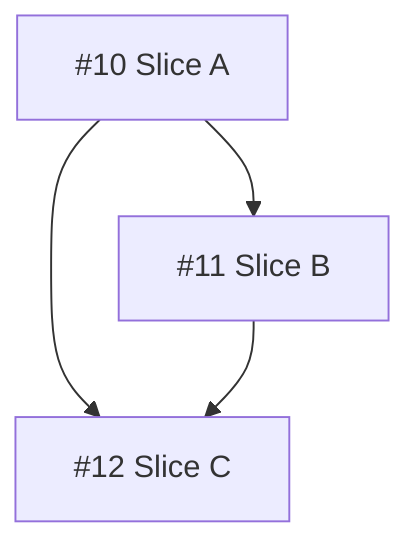

# PRD to Issues

Break a PRD into independently-grabbable GitHub issues using vertical slices (tracer bullets).

## Required skills

- Use `/gh-cli` for GitHub interactions (fetching PRDs, creating issues, and issue updates).
- For the PRD at hand, explicitly identify which skills the agent should use for each slice.
- **Do NOT recommend** `/writing-plans` or `/simplify` as required skills for issues. These are interactive skills meant for human-driven sessions, not for autonomous agent work on issue slices. Stick to skills that agents can execute autonomously (e.g. `/gh-cli`, `/git-commit`).

## Process

### 1. Locate the PRD

Ask the user for the PRD GitHub issue number (or URL).

If the PRD is not already in your context window, fetch it with `gh issue view <number>` (with comments).

### 2. Explore the codebase (optional)

If you have not already explored the codebase, do so to understand the current state of the code.

### 3. Draft vertical slices

Break the PRD into **tracer bullet** issues. Each issue is a thin vertical slice that cuts through ALL integration layers end-to-end, NOT a horizontal slice of one layer.

Slices may be 'HITL' or 'AFK'. HITL slices require human interaction, such as an architectural decision or a design review. AFK slices can be implemented and merged without human interaction. Prefer AFK over HITL where possible.

<vertical-slice-rules>
- Each slice delivers a narrow but COMPLETE path through every layer (schema, API, UI, tests)
- A completed slice is demoable or verifiable on its own
- Prefer many thin slices over few thick ones
</vertical-slice-rules>

### 4. Quiz the user

Present the proposed breakdown as a numbered list. For each slice, show:

- **Title**: short descriptive name
- **Type**: HITL / AFK
- **Blocked by**: which other slices (if any) must complete first
- **User stories covered**: which user stories from the PRD this addresses
- **Required skills**: which skills the agent should use to deliver this slice

Ask the user:

- Does the granularity feel right? (too coarse / too fine)
- Are the dependency relationships correct?
- Should any slices be merged or split further?
- Are the correct slices marked as HITL and AFK?

Iterate until the user approves the breakdown.

### 5. Create the GitHub issues

For each approved slice, create a GitHub issue using `gh issue create` with the label `prd-child`. Use the issue body template below.

Create issues in dependency order (blockers first) so you can reference real issue numbers in the "Blocked by" field.

<issue-template>
## Parent PRD

#<prd-issue-number>

## What to build

A concise description of this vertical slice. Describe the end-to-end behavior, not layer-by-layer implementation. Reference specific sections of the parent PRD rather than duplicating content.

## Acceptance criteria

- [ ] Criterion 1
- [ ] Criterion 2
- [ ] Criterion 3

## Blocked by

- Blocked by #<issue-number> (if any)

Or "None - can start immediately" if no blockers.

## User stories addressed

Write the relevant user stories explicitly from the parent PRD (do not reference only by number):

- As a <user>, I want <goal>, so that <benefit>.
- As a <user>, I want <goal>, so that <benefit>.

## Required skills

List the skills the agent should use for this slice. Include `/gh-cli` when GitHub interaction is required.

- /gh-cli
- <other-skill-name>

</issue-template>

### 6. Update the parent PRD issue

After all child issues are created, update the **body** of the parent PRD issue (using `gh issue edit`) to append an implementation tracking section at the bottom. This section should include:

1. A **table** listing all child issues with their issue number, title, and blockers.
2. A **Mermaid dependency graph** showing the dependency relationships between all child issues. Use `graph TD` (top-down) with issue numbers as node IDs and arrows pointing from blockers to dependents.

Also add the `prd-parent` label to the parent PRD issue.

<parent-update-example>

## Implementation Issues

| Issue | Title | Blocked by |
|---|---|---|
| #10 | Slice A | — |
| #11 | Slice B | #10 |
| #12 | Slice C | #10, #11 |

</parent-update-example>

Do NOT close the parent PRD issue.

## Handoff

After all issues are created and the parent is updated, ask:

> Time to orchestrate. Do you want me to `/clear` my context and `/orchestrate-prd`?
